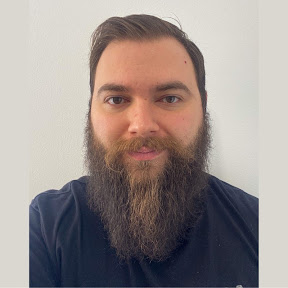

# Markus Fantone
`Software Developer, Tech Leader and Agilist`

## :raising_hand_man: About Me

Hi! I’m Markus, I’m a dad, husband, software developer, technical leader and agilist. I’ve graduated in Information Systems in 2013 and have an MBA in IT Management finished in 2020.

I’m on the Technology market for over 14 years and
I started my career as a developer in March/2010. Worked in several areas involving software development, from requirements gathering, development, management to training new professionals. I had my first contact with agile around 2014.

With technical and management skills, I have evolved my career through positions like developer, technical leader, agile project leader, Scrum Master, Project/Account Manager and Agile Coach, always seeking continuous improvement in all areas. 

## URLs
- [GitHub](https://github.com/markusfantone)
- [LinkedIn](https://www.linkedin.com/in/markus-fantone/)
- [Personal Website](http://markusfantone.com)

## Main Knowledge

|Tech Knowledge |  |
|-|-|
| `BACKEND DEVELOPMENT (.NET, NODE)` | `FRONTEND DEVELOPMENT (ANGULAR TS, VANILLA)` |
| `SYSTEMS MODELING` | `DEVOPS (CI/CD)` |
| `QUALITY ASSURANCE (FUNCTIONAL AND AUTOMATION)` | `SQL AND NOSQL` |
| `ORM (EF, DAPPER)` | `RABBITMQ` |
| `MICROSERVICES` | `REST` |
| `COPILOT` | `CLEAN CODE AND SOLID` |
| `KUBERNETS`| `GRAFANA`|

| Competences | Software |
|-|-|
|`AGILITY`| `AZURE DEVOPS – ADVANCED` |
|`LEADERSHIP`| `JIRA – ADVANCED` |
|`AGILE MANAGEMENT`| `OFFICE – ADVANCED` |
|`BACKEND DEVELOPMENT`| `POWER BI – MID` |
|`FLUENT ENGLISH`| `VISUAL STUDIO - ADVANCED` |